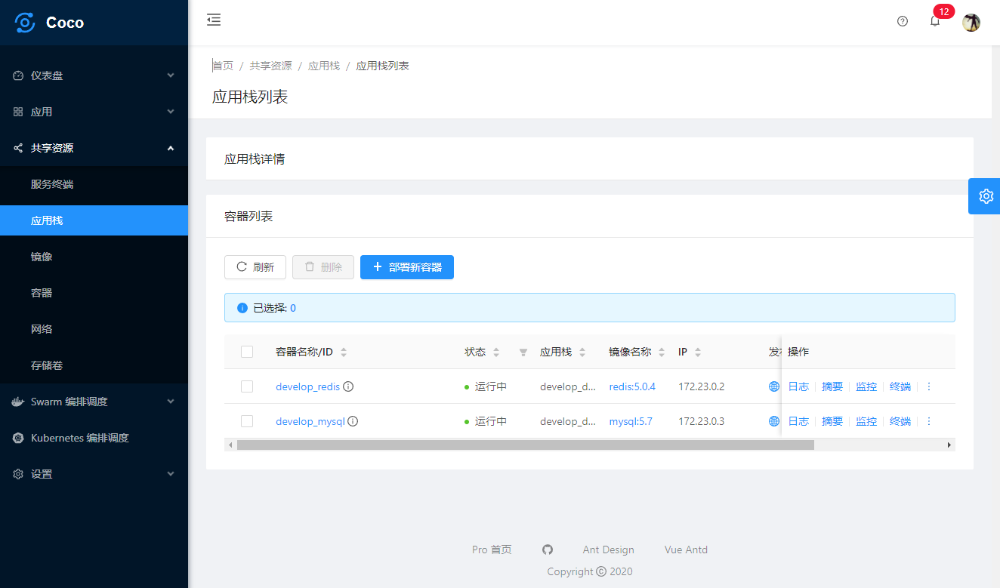

English | [简体中文](./README.zh-CN.md)

<h1 align="center">Docker CaaS Web</h1>

<div align="center">
Docker devOps manager solution for enterprise applications
</div>

<div align="center">

[](#backers) [](#sponsors) [](https://github.com/sendya/ant-design-pro-vue/blob/master/LICENSE)
[](https://github.com/sinton/coco-web/releases/latest)
[](https://travis-ci.org/sendya/coco-web)

</div>

- Demo: https://demo.caas.0x1010.com
- Home Page: https://caas.0x1010.com
- Documentation: https://caas.0x1010.com/docs/getting-started
- ChangeLog: https://caas.0x1010.com/docs/changelog
- FAQ: https://caas.0x1010.com/docs/faq
- Branches:
  - feature/pro: antdv framework
  - feature/third-party-auth: LDAP、Github's OAuth support
  - feature/ic: aliyun's ECS、amazon's AWS support


Overview
----




### Env and dependencies

- node
- yarn
- webpack
- eslint
- @vue/cli ~3
- [ant-design-vue](https://github.com/vueComponent/ant-design-vue) - Ant Design Of Vue
- [ant-design-vue-pro](https://github.com/vueComponent/ant-design-pro-vue) - Ant Design Pro Of Vue

> Note:  [Yarn](https://yarnpkg.com/) package management is recommended, the exact same version loaded with the demo site of this project (yarn.lock) . but you can also use npm


### Project setup

- Clone repo
```bash
git clone https://github.com/Sinton/coco-web.git
cd coco-web
```

- Install dependencies
```
yarn install
```

- Compiles and hot-reloads for development
```
yarn run serve
```

- Compiles and minifies for production
```
yarn run build
```

- Lints and fixes files
```
yarn run lint
```


### Other

- **IMPORTANT : About Issue feedback !! when opening Issue read [Issue / PR Contributing](https://github.com/Sinton/coco-web/issues/90)**
